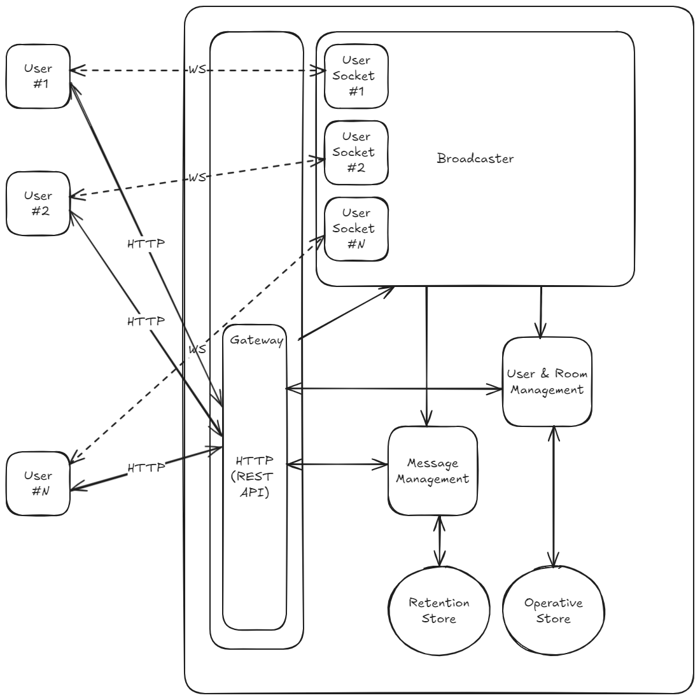

# Simple Chat

## Introduction

This simple chat server prototype allows users to exchange real-time messages in the chat rooms.

## Functional requirements

* Messages should be sent and received via WebSockets.
* There are many chat rooms, each of which can be joined by multiple users.
* To send a message, the user needs to join a chat room.
* Message sent to the chat room broadcasts to all users in this room, including back to the sender.
* Any user can create new chat rooms, which other users can join.
* Any user can participate in several chat rooms simultaneously.
* Joining and creating rooms should be done via HTTP POST calls.

## Diagram

## Description

* The user’s client application is supposed to have a login/logout functionality, a list of rooms, a chat log window, join and create room buttons, and send message input controls.
* A client communicates with the **gateway** via HTTP. The gateway intends to orchestrate HTTP and Websocket communications with clients and coordinate data persistence. It runs an HTTP server and handles REST API calls.
* During the first client’s call (login) to the `ws://` protocol endpoint, the gateway upgrades the HTTP call to WebSocket, establishing a bidirectional connection between client and server. It also starts two parallel routines, one listening for reads from the client (when a client sends a message) and the other for writes from different  system parts (when the server sends a message to the client).
* Chat coordination is initiated at the server's start by launching a **broadcaster** as another parallel routine. The broadcaster records all opened client sockets and is responsible for spreading a message to the right destination (in our case, all users in the same room). It also manages adding and removing sockets while users log in and log out and can disconnect stuck clients.
* **User and room management** maintains records and relations between users and rooms and serves clients’ requests to create and join rooms.
* **Message management** defines message and notification structure and organizes retention for chat history.
* Currently, both operative and retention stores are implemented as simple in-memory maps; persistence is maintained only while the server runs; all data is lost after a shutdown.

## To-Do’s

As this service is just a quick prototype, it should be extended in various directions to perform at scale in real-world scenarios.

* User and room objects should have IDs like GUIDs; the name is the identifier right now, which is unacceptable for consistency and security reasons.
* Login/logout in this prototype is just an imitation of the authentication/authorization flow; it only checks that users with the same name cannot login simultaneously from several client application instances.
* Metadata for users and rooms needs to be included; there are plenty of potential attributes to those objects, like activity statistics, geolocation, language preferences, etc.
* Storage for users and rooms should be persistent; the best options would be an in-memory caching database (e.g., Redis) and an SQL database for the proper relationship representation. A graph database could be considered if social network features like friends, followers, and ad-hoc recommendations are required.
* The simple static JSON message object represents chat text messages or notifications. It could be presented as an interface with various implementations and serialization.
* Message IDs should be introduced and maintained to ensure proper history retrieval; a logical clock should be considered for that.
* Message retention stores should maintain eviction after a certain volume is exceeded and have a low-cost big store backup for archives.
* The WebSocket exchange implementation is very basic and covers only simple connect-exchange-close scenarios. The heartbeat should be added via ping-pong periodic exchange to ensure the connection is alive over time. Buffered channels can also be used to queue messages. Retry policy, circuit breakers, and restore connectivity logic should be considered.
* The service configuration is hard-coded; it should be set as an environment variable for running several environments, such as dev, staging, testing, pre-production, and production.
* Extensive unit tests and integration tests should be added.
* Extended logging, metrics, and alerts middleware should be set up.

## Running service

Need to have Go 1.21 or later version installed (version requirement could be relaxed with minor change to a code, replacing `slices` library usage).

To run a server, change to `chatter` directory and run `go run cmd/server/main.go` . The server will run on `localhost:8080` .

To launch a simple client browser application., run `go run cmd/client/main.go` . It is a single static page website accessible via `localhost:8081`. One browser tab represents one client, multiple tabs/browser windows can be opened under the same address to imitate other username logins.

Note: this client application is a bare-bones harness for testing using primitive controls and simple Javascript. It is far from perfect.

